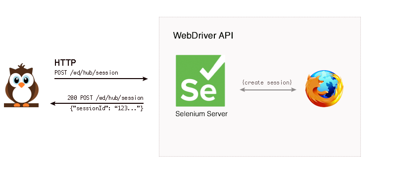
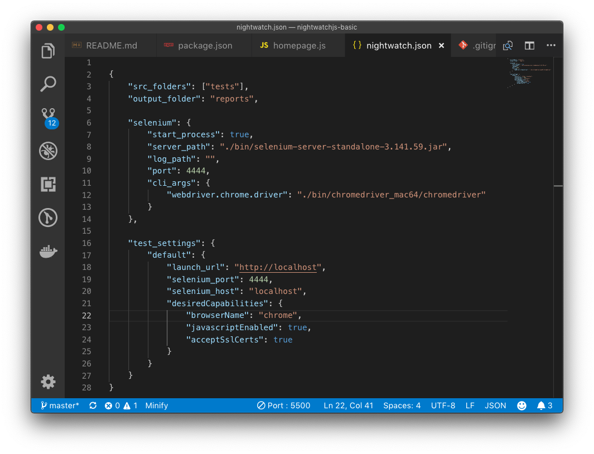
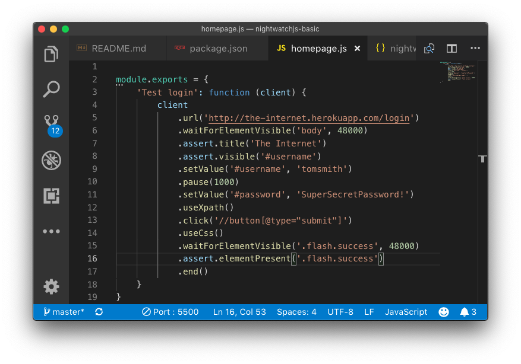
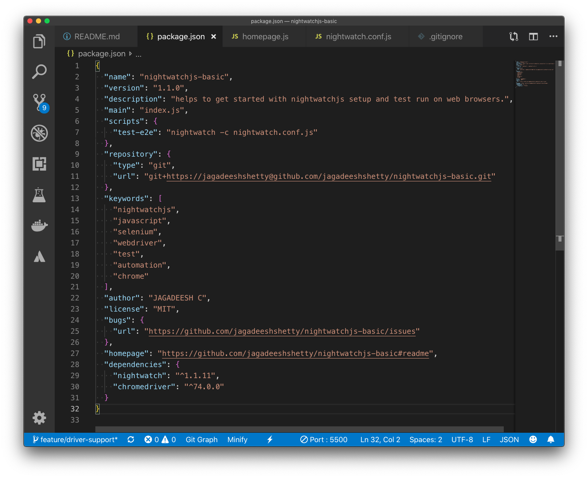
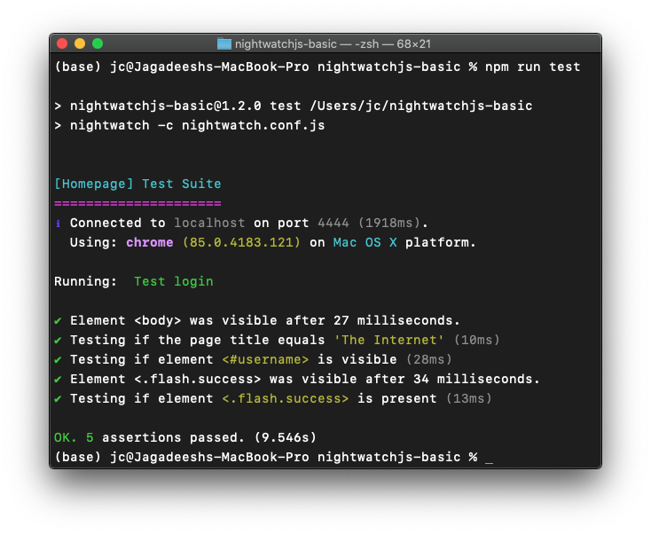

# What is Nightwatch

Nightwatch.js is an automated testing framework for web applications and websites, written in Node.js and using the [W3C WebDriver](https://www.w3.org/TR/webdriver/) API (formerly [Selenium WebDriver](https://github.com/SeleniumHQ/selenium/wiki/JsonWireProtocol)).

It is a complete End-to-End testing solution which aims to simplify writing automated tests and setting up Continuous Integration. Nightwatch can also be used for writing Node.js unit and integration tests.

*The name Nightwatch was inspired by the famous painting The Night Watch by Dutch artist Rembrandt van Rijn. The masterpiece is prominently displayed in the Rijksmuseum, in Amsterdam - The Netherlands.*

# Overview of WebDriver

WebDriver is a general purpose library for automating web browsers. It was started as part of the [Selenium](https://docs.seleniumhq.org/projects/webdriver/) project, which is a popular and comprehensive set of tools for browser automation initially written for Java but now with support for most programming languages.

Nightwatch uses the [WebDriver API](https://www.w3.org/TR/webdriver/) to perform the browser automation related tasks, like opening windows and clicking links for instance.

WebDriver is now a W3C specification aiming to standardize browser automation. WebDriver is a remote control interface that enables introspection and control of user agents. It provides a platform and a restful HTTP api as a way for web browsers to be remotely controlled.

# Theory of Operation

Nightwatch works by communicating over a restful HTTP API with a WebDriver server (such as ChromeDriver or Selenium Server). The protocol is defined by the W3C WebDriver spec, which is derived from [JSON Wire protocol](https://github.com/SeleniumHQ/selenium/wiki/JsonWireProtocol). See below for an example workflow for browser initialization.

Most of the times, Nightwatch needs to send at least 2 requests to the WebDriver server in order to perform a command or assertion.
...The first one being the request to locate an element given a CSS selector (or Xpath expression)
...Next to perform the actual command/assertion on the given element.

# Setup

1. **Node.js** should be installed.
2. **NPM** should be installed.
3. Create a directory with **nightwatchjs-basic** name.
4. Run `npm init` and complete with basic details.
5. Run `npm install nightwatch` to install nightwatch within workspace.
6. Download `selenium` and `chrome` drivers and copy to `bin` directory.
7. Create `nightwatch.json` file within working directory. The nightwatch test runner binary expects a configuration file.
8. Create `tests` directory and create `homepage.js` file.
9. Update `package.json` with test runner for `scripts` value.

# Screenshots

## nightwatch.conf

  

## tests/homepage.js

  

## package.json

  

# Run

# Reference

[Official Nightwatch](http://nightwatchjs.org/gettingstarted)
